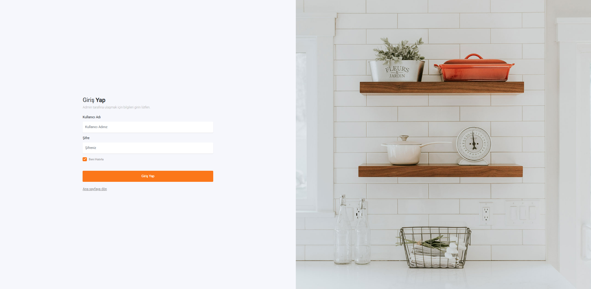
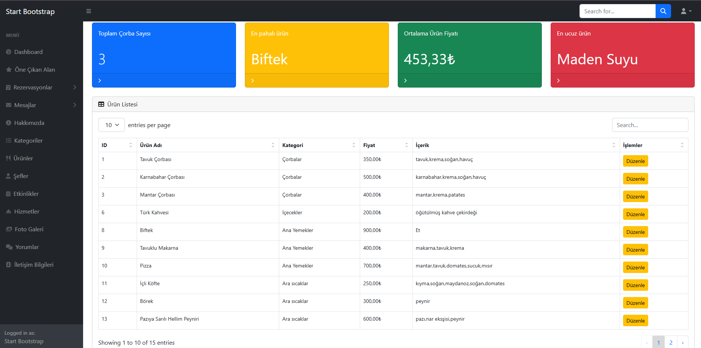
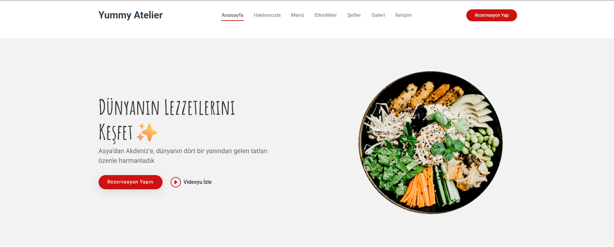
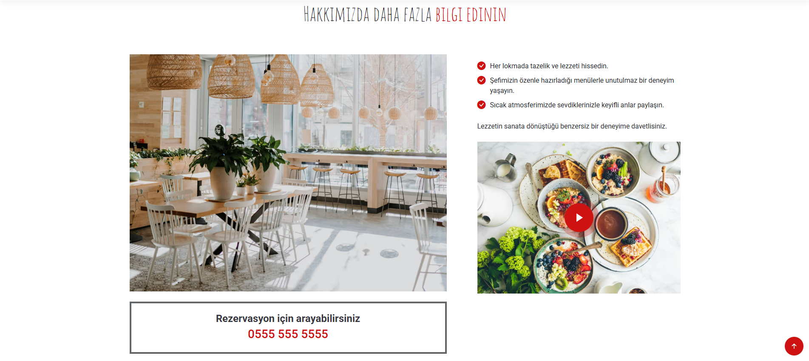
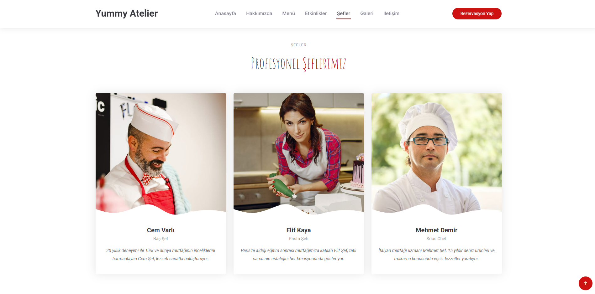
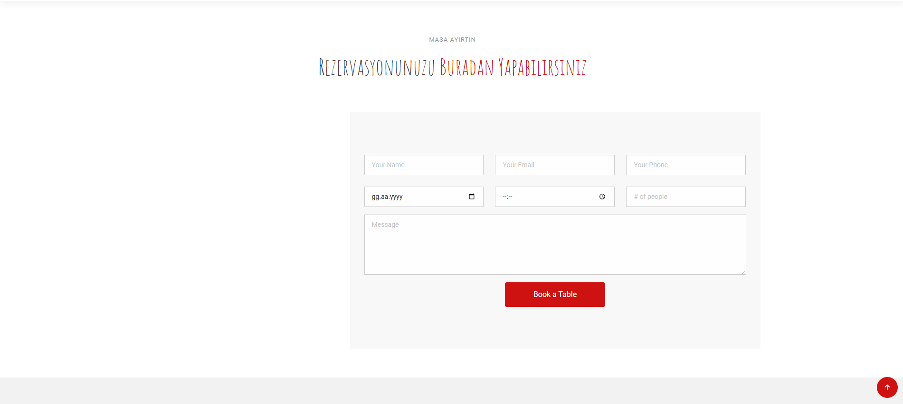
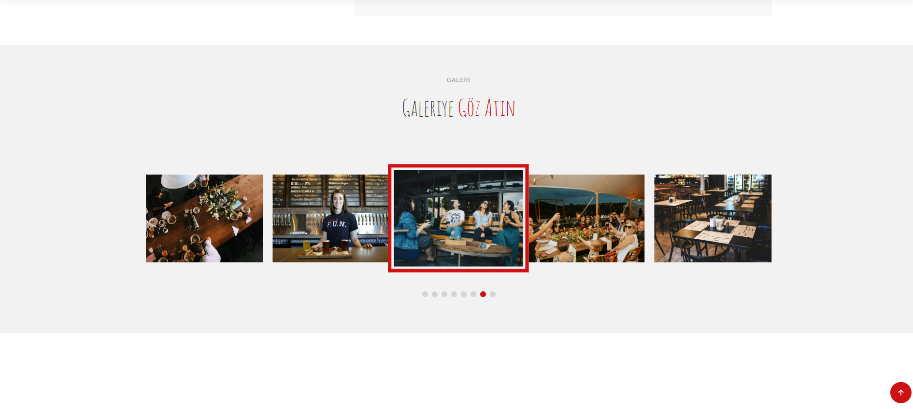
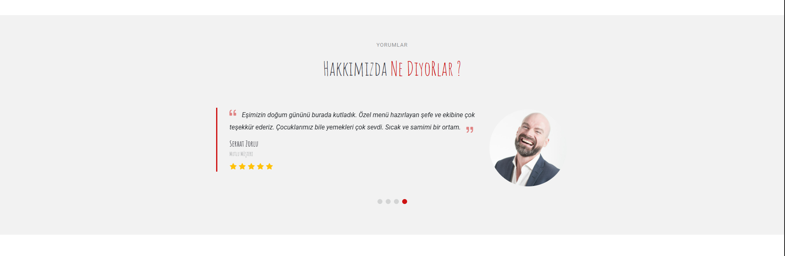

📸 Proje Görselleri

🔐 Admin Giriş Paneli

📊 Admin Paneli

 🏠 Ana Sayfa

 🏠 Ana Sayfa

🧑‍🍳 Şefler Bölümü

🗓️ Rezervasyon Yönetimi

🖼️ Fotoğraf Galerisi

💬 Müşteri Yorumları

✨ Özellikler
🌐 Kullanıcı Arayüzü (Frontend)

Ana Sayfa (Home):

Dinamik banner alanı, restoran tanıtımı, görseller ve video bölümü.

Menü (Ürünler):

Kategorilere göre filtrelenmiş ürün listesi.

Ürün adı, açıklama, fiyat ve fotoğraf alanları.

Rezervasyon Formu:

Müşteri bilgileri, kişi sayısı, tarih, saat seçimi.

Veritabanına kayıt ve admin onay mekanizması.

Şefler Bölümü:

Şef bilgileri (isim, uzmanlık, fotoğraf).

Şefin sosyal medya bağlantıları (Instagram, Twitter, LinkedIn).

Etkinlikler (Events):

Restoranda düzenlenecek özel etkinliklerin listesi.

Fotoğraf Galerisi:

Restoran ve yemek görselleri için dinamik galeri.

Müşteri Yorumları (Testimonials):

Gerçek müşteri geri bildirimlerinin dinamik gösterimi.

İletişim Sayfası:

Telefon, e-posta, adres bilgileri.

Google Maps entegrasyonu.

🔐 Yönetici Paneli (Admin)
👤 Giriş ve Güvenlik

Forms Authentication sistemiyle güvenli giriş.

Session tabanlı kimlik doğrulama.

Hatalı giriş bildirimleri ve “Beni Hatırla” özelliği.

📊 Dashboard

Toplam ürün, kategori, şef, rezervasyon sayıları.

En yüksek ve en düşük fiyatlı ürün istatistikleri.

Yeni rezervasyon ve mesaj bildirimleri.

🗂️ İçerik Yönetimi (CRUD)

About (Hakkımızda):

Metin, görsel ve video alanlarını düzenleme.

Kategori Yönetimi:

Yeni kategori ekleme, güncelleme, silme.

Ürün Yönetimi:

Menü ürünlerini ekleme, düzenleme, silme.

Ürün fiyatı, açıklama, görsel ve kategori seçimi.

Rezervasyon Yönetimi:

Yeni rezervasyonları görüntüleme, onaylama veya reddetme.

Müşteri adı, kişi sayısı, tarih, saat bilgisi.

Şef Yönetimi:

Şef bilgileri ekleme, güncelleme, silme.

Şefin sosyal medya hesaplarını yönetme.

Etkinlik Yönetimi:

Yeni etkinlik ekleme, düzenleme, silme.

Fotoğraf Galerisi:

Görsel ekleme, açıklama ve kategori düzenleme.

Yorum Yönetimi (Testimonial):

Müşteri yorumlarını yönetme (aktif/pasif durumu).

İletişim Bilgileri:

Telefon, e-posta, adres ve harita linki düzenleme.

🎨 Tasarım Özellikleri
Kullanıcı Arayüzü

🎨 Modern & Minimalist Tasarım:

Açık renkli, ferah görünüm.

Akıcı animasyon geçişleri.

📱 Tamamen Responsive:

Mobil, tablet ve masaüstü cihazlara tam uyum.

✨ Bootstrap 5 ile Şık Görünüm:

Grid sistemi, kart tasarımları, butonlar ve modallar.

📷 Dinamik Görsel Alanları:

Banner, galeri ve testimonial bölümleri dinamik olarak yönetilebilir.

Yönetici Paneli

🌑 Dark Theme (Koyu Tema)

🧭 Sidebar Navigasyon:

Menü, ürün, kategori, rezervasyon, şef, mesaj, galeri, hizmet ve istatistiklere erişim.

🧩 Bootstrap Tabloları:

Veritabanı verilerini tablo halinde gösterim.

✅ Form Validasyonu:

Boş alan kontrolü, görsel yükleme denetimi.

🛠️ Kullanılan Teknolojiler
Katman	Teknoloji
Backend	ASP.NET MVC 5 (C#)
ORM	Entity Framework 6 (Code First)
Veritabanı	Microsoft SQL Server
Frontend	HTML5, CSS3, Bootstrap 5, jQuery
Authentication	Forms Authentication
IDE	Visual Studio 2022
UI Template	DarkPan (Admin) / Custom Frontend Design

💡 Öğrenme Çıkarımları

Bu projeyle:

Katmanlı mimari (Model-View-Controller) yapısını öğrendim.

Entity Framework Code First yapısını uyguladım.

CRUD işlemlerinde LINQ ve EF kullandım.

Forms Authentication ile admin girişi oluşturdum.

Bootstrap ve Razor View ile dinamik arayüz tasarladım.

Veritabanı ilişkilerini yönetmeyi öğrendim.

📞 İletişim
👩‍💻 Geliştirici: Buse Yeşil

📧 Email: buseyesil55@gmail.com

💼 LinkedIn: linkedin.com/in/buse-yesil

🧩 Kullanılan Şablonlar & Kütüphaneler

DarkPan Template
 – Admin Panel Tasarımı

Bootstrap 5
 – Responsive Arayüz

Font Awesome
 – İkon Seti

jQuery
 – Dinamik işlemler

Entity Framework
 – ORM (Veritabanı yönetimi)

🎓 Sonuç

Yummy Project, modern web teknolojileriyle geliştirilmiş, yönetilebilir, şık ve profesyonel bir restoran yönetim sistemidir.
Hem kullanıcı deneyimini hem de yönetici kolaylığını ön planda tutar.
Projede öğrenilen prensipler, daha büyük ölçekli kurumsal uygulamalarda da uygulanabilir yapıdadır.